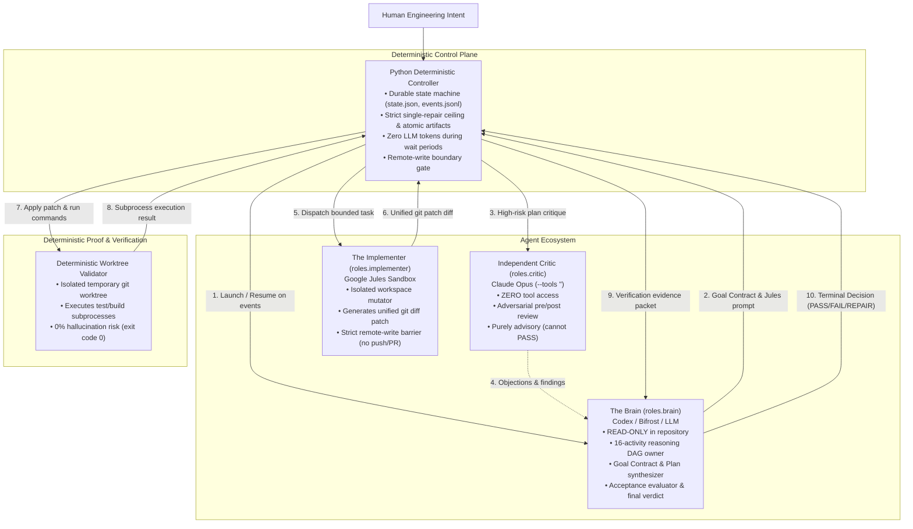
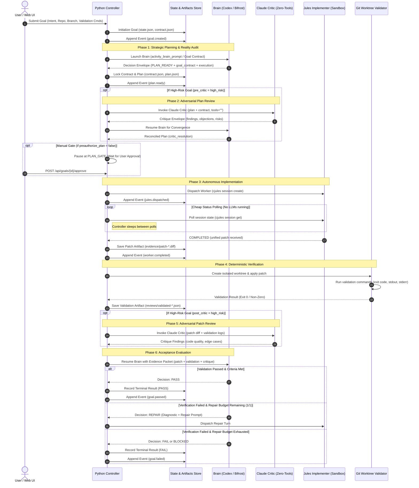

# Multi-Agent Architecture & Governance Guide (`AGENTS.md`)

> **Labeeb Orchestrator V2**  
> *A deterministic, local-first control plane for long-running, multi-agent software engineering work.*

---

## 1. Architectural Philosophy: The "Triad + 1" Model

Most agentic coding setups fail in one of three ways:
1. **The Single-Agent Hallucination Trap**: Giving a single LLM full access to plan, code, test, and declare its own work "done" inevitably produces ungrounded assumptions and self-affirming loops.
2. **The Runaway Loop Problem**: Uncontrolled autonomous loops iterate endlessly, burning tokens and corrupting codebases.
3. **The Unsafe Write Problem**: Granting LLMs unchecked git push, PR, or direct production access risks catastrophic repository blast radius.

**Labeeb Orchestrator** solves this by strictly separating concerns into four decoupled actors—**three AI agents and one deterministic controller**:



---

## 2. Participating Agent Roles & Specifications

### 2.1. The Brain (`roles.brain`)
*The Strategic Architect, Reality Auditor, and Acceptance Evaluator.*

- **Transport**: `orchestrator` CLI (backed by `codex`, Bifrost, OpenAI, or Anthropic models).
- **Filesystem Authority**: **READ-ONLY**. The Brain has zero authority to mutate workspace files, stage git changes, or invoke write tools.
- **Core Responsibilities**:
  1. **Authority Bootstrap & Goal Contract Compilation**: Parses user intent, bounds allowed file paths, and sets deterministic validation commands.
  2. **Repository Reality Audit**: Deeply inspects existing code reality, tracing callers, abstractions, and dependencies before designing changes.
  3. **Deliberate Reuse Search**: Actively searches for existing functions, helpers, and patterns to prevent redundant reinvented wheels.
  4. **Execution Plan & Jules Prompt Synthesis**: Packages explicit, bounded execution instructions into a locked prompt for the implementer.
  5. **Adversarial Critique Convergence**: Reconciles findings raised by the independent Critic, modifying plans only when evidence demands it.
  6. **Evidence Evaluation & Final Verdict**: Evaluates deterministic validation logs and patch diffs against acceptance criteria, issuing the final `PASS`, `FAIL`, `REPAIR`, or `BLOCKED` decision.

- **Reasoning Graph Execution**:
  When operating in V2 mode, the Brain advances through a formal 16-activity directed acyclic graph (DAG):

  ```mermaid
  flowchart LR
      classDef contract fill:#0284c7,stroke:#38bdf8,stroke-width:1px,color:#fff;
      classDef audit fill:#7c3aed,stroke:#a78bfa,stroke-width:1px,color:#fff;
      classDef solution fill:#d97706,stroke:#fbbf24,stroke-width:1px,color:#fff;
      classDef review fill:#dc2626,stroke:#f87171,stroke-width:1px,color:#fff;
      classDef gate fill:#059669,stroke:#34d399,stroke-width:1px,color:#fff;

      A[authority_context]:::contract --> B[goal_contract]:::contract
      B --> C[product_validation]:::contract
      C --> D[proof_contract]:::contract
      D --> E[reality_audit]:::audit
      E --> F[mutation_preflight]:::audit
      F --> G[baseline_result]:::audit
      G --> H[diagnosis]:::solution
      H --> I[solution_candidates]:::solution
      I --> J[second_audit]:::solution
      J --> K[delivery_readiness]:::solution
      K --> L[critic_review]:::review
      L --> M[convergence]:::review
      M --> N[change_authority]:::gate
      N --> O[implementation_readiness]:::gate
      O --> P[execution_contract]:::gate
  ```

  #### AI-Parseable DAG Activity Specification (16 Activities)

  | Step | Activity Identifier | Canonical Enum | Stage Category | Primary Objective | Output Artifact | Next Direct Activity / Allowed Skips |
  | :--- | :--- | :--- | :--- | :--- | :--- | :--- |
  | 1 | `authority_context` | `authority_context` | Contract | Extract authority boundaries and workspace path | `authority_context.v*.json` | `goal_contract` |
  | 2 | `goal_contract` | `goal_contract` | Contract | Compile observable outcome, current and expected behavior | `goal_contract.v*.json` | `product_validation`, or skip to `proof_contract` |
  | 3 | `product_validation` | `product_validation` | Contract | Define user journey and acceptance checklist (emit `NOT_APPLICABLE` for non-UI/backend) | `product_contract.v*.json` | `proof_contract` |
  | 4 | `proof_contract` | `proof_contract` | Contract | Define verifiable entrypoints and validation commands | `proof_contract.v*.json` | `reality_audit` |
  | 5 | `reality_audit` | `reality_audit` | Audit | Inspect callers, existing helpers, and deliberate reuse | `reality_audit.v*.json` | `mutation_preflight`, or skip to `baseline` |
  | 6 | `mutation_preflight` | `mutation_preflight` | Audit | Assess blast radius, affected modules, and bounds | `mutation_preflight.v*.json` | `baseline_result`, or skip to `diagnosis`/`solution_candidates` |
  | 7 | `baseline_result` | `baseline` | Audit | Execute validation entrypoint before edits to verify state | `baseline_result.v*.json` | `diagnosis`, or skip to `solution_candidates`/`second_audit` |
  | 8 | `diagnosis` | `diagnosis` | Solution | Diagnose root cause of baseline failure | `diagnosis.v*.json` | `solution_candidates`, or skip to `second_audit` |
  | 9 | `solution_candidates` | `solution_exploration` | Solution | Evaluate alternative approaches with reuse bias | `solution_candidates.v*.json` | `second_audit`, or forward gates |
  | 10 | `second_audit` | `second_reality_audit` | Solution | Actively attempt to disprove preferred solution | `second_audit.v*.json` | `delivery_readiness`, `critic_review`, or `change_authority` |
  | 11 | `delivery_readiness` | `delivery_readiness` | Solution | Verify solution against functional user journey (optional for backend/tests) | `delivery_review.v*.json` | `critic_review`, `convergence`, or `change_authority` |
  | 12 | `critic_review` | `independent_critique` | Review | Adversarial critique via Claude Critic (active on high-risk; can advance to change_authority if clean) | `critic_review.v*.json` | `convergence`, or skip to `change_authority` |
  | 13 | `convergence` | `convergence` | Review | Reconcile findings against repository evidence | `convergence.v*.json` | `change_authority`, or `implementation_readiness` |
  | 14 | `change_authority` | `change_authority` | Gate | Classify repair authority (LOCAL, GATED, INCIDENTAL) | `change_authority.v*.json` | `implementation_readiness`, or `execution_contract` |
  | 15 | `implementation_readiness` | `implementation_readiness` | Gate | Verify bounded allowed paths, commands, and artifacts | `implementation_readiness.v*.json` | `execution_contract` |
  | 16 | `execution_contract` | `execution_contract` | Gate | Package explicit, locked prompt for Jules implementer | `execution_contract.v*.json` | *Worker Dispatch* (`IMPLEMENTATION_READY`) |

  *Note*: Any activity can perform a self-transition (`next_activity == current_activity`) to refine its analysis or fulfill multi-turn investigation within the progress budget (`max_repeats = 3`). Any activity may also backtrack to earlier contract/audit anchors when an assumption is disproven.

- **Structured Output Protocol**:
  The Brain never emits loose chat prose. During reasoning DAG turns, it communicates exclusively via structured JSON envelopes:
  ```json
  <<<LABEEB_DECISION_START>>>
  {
    "decision": "CONTINUE_REASONING",
    "current_activity": "second_reality_audit",
    "activity_status": "SATISFIED",
    "not_applicable_reason": null,
    "next_activity": "critic_review",
    "reason": "Bounded solution verified against secondary callers; ready for adversarial critique.",
    "produced_artifact": {
      "artifact_type": "second_audit",
      "data": {
        "status": "PASS",
        "disproved_candidates": ["reinventing custom parser"],
        "accepted_candidate": "standard-library unittest"
      }
    },
    "invalidate_roots": [],
    "evidence_refs": ["file:tests/test_smoke.py#L1-L20"],
    "human_checkpoint": {
      "needed": false,
      "boundary_type": null,
      "question": null
    }
  }
  <<<LABEEB_DECISION_END>>>
  ```

  At terminal planning completion (activity `execution_contract`), the Brain emits:
  ```json
  <<<LABEEB_DECISION_START>>>
  {
    "decision": "IMPLEMENTATION_READY",
    "current_activity": "execution_contract",
    "activity_status": "SATISFIED",
    "next_activity": null,
    "reason": "Bounded execution contract formulated with locked validation commands.",
    "produced_artifact": {
      "artifact_type": "execution_contract",
      "data": {}
    },
    "execution": {
      "jules_prompt": "Create tests/test_smoke.py defining test_environment_smoke...",
      "validation_commands": [".venv/bin/python -m unittest tests/test_smoke.py"],
      "allowed_paths": ["tests/test_smoke.py"],
      "risk_tags": ["architecture"],
      "needs_pre_critic": false,
      "needs_post_critic": false
    },
    "plan_summary": "Create isolated smoke test under tests/."
  }
  <<<LABEEB_DECISION_END>>>
  ```

---

### 2.2. The Implementer (`roles.implementer` / Jules)
*The Autonomous Bounded Code Mutator.*

- **Transport**: `jules` (Google Jules autonomous coding agent invoked via the `cjules` CLI).
- **Filesystem Authority**: **ISOLATED WORKSPACE MUTATION ONLY**.
- **Remote Security Barrier**:
  ```toml
  [safety]
  allow_push = false
  allow_pr = false
  allow_merge = false
  allow_production_mutation = false
  ```
  The controller technically blocks Jules from pushing branches to origin, creating pull requests, merging code, or mutating production infrastructure.
- **Core Responsibilities**:
  1. Operates within an isolated GitHub branch sandbox created specifically for the goal.
  2. Reads the Brain's prompt and implements the exact code requested.
  3. Produces unified patch diffs (`patch-*.diff`) containing the additions and deletions.
- **Lifecycle Polling & Wake Conditions**:
  The controller polls Jules status cheaply via `cjules session get`:
  - `QUEUED`, `PLANNING`, `IN_PROGRESS`: Controller sleeps (0 tokens consumed).
  - `AWAITING_PLAN_APPROVAL`: Controller automatically approves if the plan is preauthorized by the contract.
  - `COMPLETED`: Controller downloads unified git diff, captures patch hash, and wakes the deterministic validation step.
  - `FAILED`: Controller captures error diagnostic and wakes the Brain for recovery.

---

### 2.3. The Independent Critic (`roles.critic` / Claude)
*The Adversarial Red-Team Reviewer.*

- **Transport**: Direct CLI invocation (`claude -p --tools "" --strict-mcp-config --output-format json --model opus`).
- **Enforced Security Invariant**:
  Invoked with `--tools ""` (empty string). Claude Critic has **zero tool access** and **zero filesystem write capability**. It is technically impossible for the Critic to modify files or execute commands.
- **Advisory Role**:
  **Claude Critic NEVER decides final PASS**. It provides independent, adversarial critique to challenge assumptions, flag hidden concurrency risks, or detect boundary violations. The Brain must deliberately evaluate each finding and either accept it with code changes or reject it with empirical evidence.
- **Trigger Policies**:
  - `never`: Critic is disabled.
  - `always`: Critic runs on every plan and patch.
  - `high_risk` (Default): Critic runs automatically whenever a goal contains any of the configured high-risk tags:
    ```toml
    high_risk_tags = ["architecture", "concurrency", "persistence", "security", "public_contract", "large_blast_radius"]
    ```
- **Phases**:
  - **Pre-Critic**: Evaluates the candidate execution plan before Jules is dispatched.
  - **Post-Critic**: Evaluates the unified git patch before the Brain decides final PASS.

---

### 2.4. Deterministic Worktree Validator
*The Zero-Hallucination Empirical Proof Layer.*

- **Runtime**: Native host OS shell subprocess.
- **Isolation**: Executed inside a temporary, isolated git worktree created from the base commit and patched with the unified diff. The main working tree is never touched.
- **Core Responsibilities**:
  1. Applies `patch-*.diff` cleanly to base commit.
  2. Executes the deterministic validation commands specified in the goal contract (e.g., `pytest`, `unittest`, `npm test`, `cargo check`).
  3. Records stdout, stderr, process exit code, and execution duration.
  4. Tears down the temporary worktree cleanly.
- **Safety Invariant**:
  ```toml
  [safety]
  require_validation_for_pass = true
  ```
  A goal **cannot** achieve `PASS` unless all deterministic validation commands exit with returncode `0`. An LLM stating "all tests passed" is ignored without empirical subprocess output.

---

## 3. End-to-End Multi-Agent Lifecycle

The diagram below details the exact coordination flow managed by the deterministic controller across all agents:



---

## 4. Safety Invariants & Anti-Loop Guarantees

The controller strictly enforces four hard architectural invariants that cannot be bypassed by prompts or LLM configurations:

| Invariant | Implementation Mechanism | Purpose |
| :--- | :--- | :--- |
| **Single Repair Ceiling** | `safety.max_repair_rounds = 1` | Guarantees that an implementation failure can only trigger **one** corrective repair attempt. Prevents runaway infinite loops and endless token spend. |
| **Path Non-Widening** | `labeeb.providers.jules.path_allowed()` | If the user authorizes `tests/`, the Brain cannot widen `allowed_paths` to include `src/` or `config/`. Unauthorized path expansion immediately **BLOCKS** the goal. |
| **Zero Blind Retries** | `state.execution_rounds` & idempotent hashes | Every resume operation must provide new evidence. Duplicate requests with identical hashes are rejected. |
| **Immutable File Hashing** | `file:<path>#sha256=<hash>` | Artifacts (contracts, plans, patches, reviews) are referenced using cryptographic hashes. Any accidental mutation of an artifact raises an immediate integrity violation. |
| **Remote-Write Boundary** | Explicit CLI policy (`--no-push`) | Jules operates strictly on local worktree commits. No PRs, merges, or pushes to remote origin branches are permitted without human sign-off. |

---

## 5. Storage & Artifact Layout

Every goal managed by the Orchestrator has an isolated, self-contained directory under `~/.local/state/labeeb-controller/goals/{goal_id}`:

```text
~/.local/state/labeeb-controller/goals/7ab72b97-4174-4e42-8294-95a8a9f3c227/
├── state.json                 # Durable state machine (phase, task IDs, timestamps)
├── contract.json              # Goal Contract (seed parameters + Brain audited criteria)
├── plan.json                  # Approved execution plan & Jules prompt
├── goal.lock                  # Exclusive file lock preventing concurrent controller runs
├── events.jsonl               # Append-only chronological domain event trail
├── controller.log             # Human-readable controller execution log
├── STOP                       # Optional marker file; if created, halts execution gracefully
├── result.json                # Terminal outcome packet (verdict, duration, summary)
├── artifacts/                 # Versioned immutable artifacts from the reasoning graph
│   ├── goal_contract.v1.json
│   ├── reality_audit.v1.json
│   └── execution_contract.v1.json
├── requests/                  # Cached RPC payloads and responses
│   ├── brain_launch-*.result.json
│   └── jules_create-*.result.json
├── evidence/                  # Raw evidence files
│   └── patch-*.diff           # Unified git patch from implementer
└── reviews/                   # Verification and critique records
    ├── validated-*.json       # Subprocess validation logs (exit code, stdout)
    └── critic-*.json          # Claude Critic findings
```

---

## 6. Configuration Reference (`config.toml`)

The system configuration governs agent roles, runtimes, timeouts, and safety limits. Below is the annotated reference:

```toml
# Core controller poll rates and safety boundaries
[controller]
state_root = "~/.local/state/labeeb-controller"
poll_seconds = 20                   # Background loop polling interval
agent_poll_seconds = 5             # In-flight agent check interval
goal_deadline_hours = 12           # Automatic expiration ceiling
brain_transient_retry_limit = 3    # Max retries on network/transient failures

# Binary executables discovered on host system
[executables]
orchestrator = "orchestrator"      # CLI provider for the Brain
cjules = "cjules"                  # CLI provider for Google Jules
git = "git"                        # Host git binary for worktrees
shell = "/bin/bash"

# Workflow roles & policies
[workflow]
brain_role = "brain"
critic_role = "critic"
implementer_role = "implementer"

pre_critic = "high_risk"           # never | high_risk | always
post_critic = "high_risk"          # never | high_risk | always
high_risk_tags = [
  "architecture",
  "concurrency",
  "persistence",
  "security",
  "public_contract",
  "large_blast_radius"
]

# Strict Safety Invariants (V1/V2 enforced)
[safety]
max_repair_rounds = 1              # Hard maximum of 1 repair attempt
require_patch_for_implementation = true
require_validation_for_pass = true
allow_push = false                 # Block remote git push
allow_pr = false                   # Block remote PR creation
allow_merge = false                # Block git merge
allow_production_mutation = false  # Block production deployments

# Role Definitions
[roles.brain]
transport = "orchestrator"
runtime = "codex"
model = ""

[roles.critic]
transport = "direct"
read_only = true
timeout_seconds = 900
command = ["claude", "-p", "--tools", "", "--strict-mcp-config", "--output-format", "json", "--model", "opus"]

[roles.implementer]
transport = "jules"
command = "cjules"
```

---

## 7. Extending and Adding New Agent Providers

To introduce a new agent or change an existing provider (e.g., swapping Jules for another autonomous implementer, or running the Brain against a custom local LLM):

1. **Implement the Provider Adapter**:
   Add a new provider class under `labeeb/providers/` conforming to `BaseProvider` (`launch()`, `resume()`, `status()`).
2. **Define Role Transport**:
   Update `config.toml` under `[roles.<role_name>]` with the transport identifier and command arguments.
3. **Preserve Invariants**:
   Ensure the provider honors the read-only contract for Brain/Critic roles and routes all code modifications through unified patches evaluated by the Deterministic Worktree Validator.
