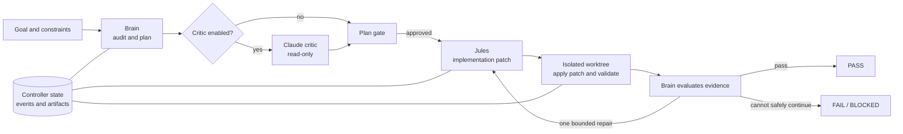
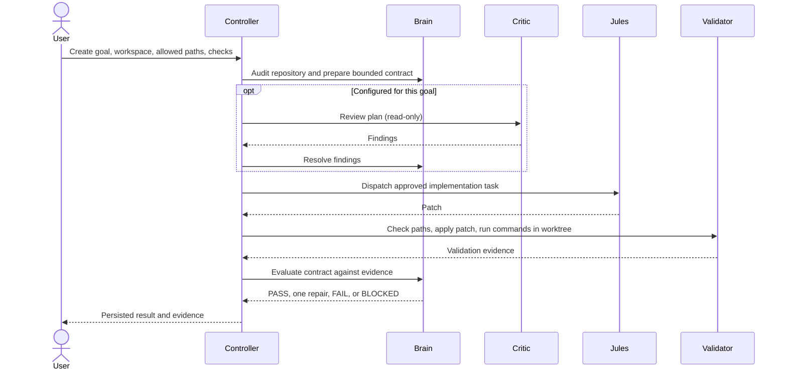

# Labeeb Orchestrator

### From engineering intent to verified code—without handing control to an AI loop.

Labeeb turns a software task into a controlled, reviewable workflow. Codex investigates and plans, Claude can challenge the plan, and Jules implements the approved change. A local controller keeps the process bounded, while deterministic checks verify the patch before a goal can pass.

| [](https://openai.com/codex/) | [](https://www.anthropic.com/claude) | [](https://jules.google/) | ⚙️ **Labeeb** · controller |
| Plans and evaluates | Optional, read-only review | Implements approved work | Coordinates and verifies |

**Built for teams that need AI speed with engineering controls:** scoped changes, durable progress, recoverable workflows, and results backed by validation evidence.



## What makes it different

- **Bounded execution:** one automatic repair round; paths and validation commands are scoped per goal.
- **Crash-aware side effects:** state is persisted before external actions, and ambiguous outcomes are reconciled instead of blindly retried.
- **Evidence-based results:** patches are path-checked and validated in a temporary worktree. An agent's “done” message alone cannot pass a goal.
- **Local control:** goals, events, and artifacts live on the machine. No automatic push, PR, merge, or production mutation.

## How it works



The Brain follows a persisted reasoning graph for contract, repository audit, solution review, critique/convergence, and implementation readiness. If proof invalidates an assumption, the workflow can return to reasoning without spending the targeted repair round. See the [V2 flow guide](docs/LABEEB_CONTROLLER_V2_FLOW_GUIDE.md) for the activity graph and artifact rules.

## Get started

Run these from the project directory:

```bash
make setup
make doctor
make web
```

Open <http://127.0.0.1:8765>. `make help` lists every available command.

Create a goal and pass its options through `ARGS`:

```bash
make start ARGS='--intent "Add a focused smoke test" --workspace /path/to/repository --repo OWNER/REPO --branch main --allow-path tests --validate ".venv/bin/python -m unittest discover -s tests" --preauthorize-plan --background'
```

Manage it with the same Make interface:

```bash
make status ARGS=<goal-id>
make approve ARGS=<goal-id>
make run ARGS=<goal-id>
make stop ARGS=<goal-id>
```

Omit `--preauthorize-plan` to require explicit plan approval. `--background` detaches the controller process; it continues only while the host/WSL instance is running.

## Installation

### Requirements

- Python 3.11+
- `git`, `orchestrator`, and `cjules` on `PATH` (or configured executable paths)
- Optional: `claude` for the independent critic
- Python packages in `requirements.txt` for the Web UI/API

The controller core uses the Python standard library. The Web UI/API uses FastAPI, Uvicorn, Jinja2, HTTPX, and python-multipart.

`make setup` creates `.venv` and installs the Web UI/API dependencies. The default interpreter is `python3`; override it if needed, for example `make setup PYTHON=python3.11`.

By default, commands read `config.toml` from the project directory. Choose another config with `CONFIG=...`:

```bash
make doctor CONFIG=~/.config/labeeb-controller/config.toml
```

### Available commands

`make help` is the source of truth. Targets include `doctor`, `web`, `start`, `run`, `approve`, `status`, `background`, `stop`, `reconcile`, `unblock`, `version`, `test`, and `test-unittest`. Pass CLI flags or goal IDs with `ARGS='...'`.

Goal state defaults to `~/.local/state/labeeb-controller/goals/<goal-id>/`. It includes the state machine, append-only event log, immutable reasoning artifacts, requests, patches, validation results, and reviews.

## Safety boundaries

| Boundary | Controller behavior |
| --- | --- |
| Concurrent goal actions | One writer per goal, protected by a file lock |
| Persistence | Atomic state replacement with `fsync` |
| Uncertain external write | Reconcile persisted intent and provider state; block if ambiguous |
| Implementation scope | Reject patches that change paths outside the goal's allowed paths |
| Repair | At most one targeted automatic repair |
| Validation | Run configured commands against the patch in a detached temporary worktree |
| Remote actions | Push, PR, merge, and production mutation are disabled |

Validation commands execute on the host with the configured shell. Choose commands appropriate for your repository; Labeeb does not install project dependencies for them.

## Documentation

- [Usage guide](docs/usage.md) — CLI and Web UI workflows
- [V2 flow guide](docs/LABEEB_CONTROLLER_V2_FLOW_GUIDE.md) — reasoning graph, backtracking, and artifacts
- [Developer guide](docs/LABEEB_CONTROLLER_DEVELOPER_GUIDE.md) — modules, providers, and controller internals
- [Design](docs/DESIGN.md) — architecture rationale and boundaries
- [Walkthroughs](docs/) — versioned walkthroughs and research notes

## Development

```bash
make test
```

`make test` runs the full pytest suite; `make test-unittest` runs legacy unittest discovery only.
